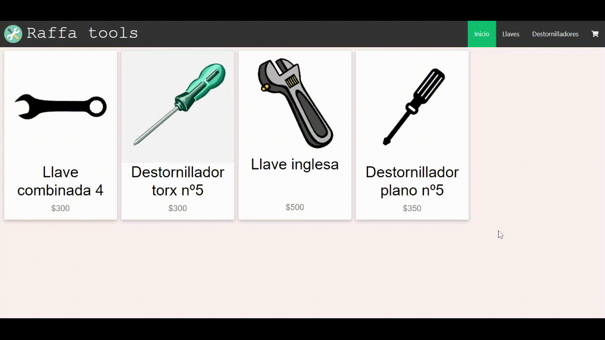

# E-Commerce Raffa Tools

Mi nombre es Nicolás Raffagnini y este es mi E-Commerce creado en el curso React.JS de Coderhouse 

## 

## 
# Herramientas-dependencias utilizadas

[Firebase](https://firebase.google.com/).  
Utilicé Firebase para guardar tanto los productos que se muestran en la página como las órdenes de compra creadas por el usuario.

[React-Router-Dom](https://reactrouter.com/web/guides/quick-start).  
Esta librería se encarga de generar rutas dinámicas para asi facilitar la navegabilidad por el sitio.

[FontAwesome](https://fontawesome.com).  
Utilicé font awesome para agregar algunos íconos al sitio.

[React-Bootrstrap](https://react-bootstrap.github.io)
Utilicé bootstrap para darle algunos estilos al sitio.

## Hooks

useState (React).  
useEffect (React).  
useContext (React).
useParams (React-Router-Dom).  

